# Predictive maintenance for wind turbines

## Introduction

This repository contains the code for the final master thesis project of the MSc. Big Data Analytics at Universitat Politécnica de Valencia and is focused on the development of a predictive maintenance system for wind turbines. The methodology used is described in the thesis [here](https://drive.google.com/file/d/1PW2BmiOykbafdPJOVP3f42tXJhEdpf69/view?usp=drive_link) (in Spanish). The thesis was graded with a 9.5/10.

This project is a continuation of the master thesis project, and the main goal is to improve the models and methodology used in the thesis.

## Data

The data used for this project is the [HTW 2018: Wind Turbine Failures Detection](https://opendata.edp.com/open-data/en/hack-the-wind.html) dataset. The data is available in the `data/raw` folder of this repository.

## Code

MLflow is used to track the experiments and the models. The code is available in the `src` and `notebooks` folders of this repository.

## Results

The hackathon dataset has 2 years of data. The train/test split is shown in the following figure:

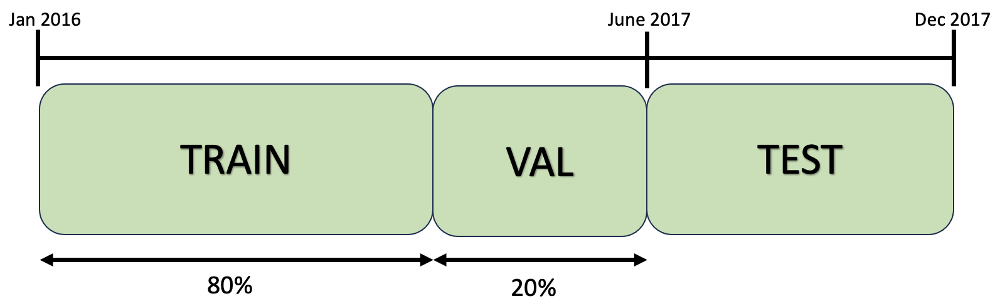

The only components that have failures in the test dataset are:

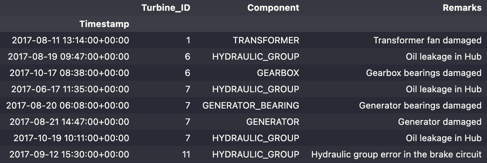

The next figures shows the results of the best models for each component temperature available in the dataset:

### Turbine 1

#### TRANSFORMER

Benefit = 27718.22€
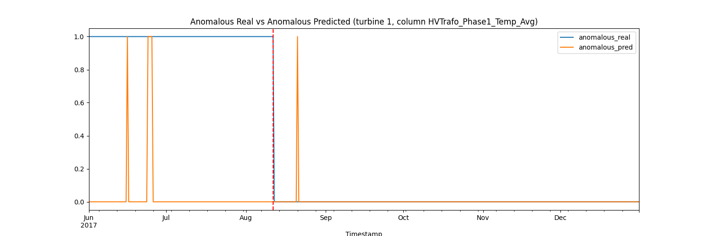

Benefit = 32934.88€
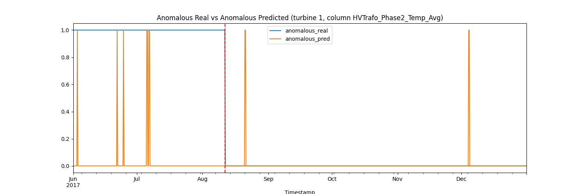

Benefit = 30351.55€
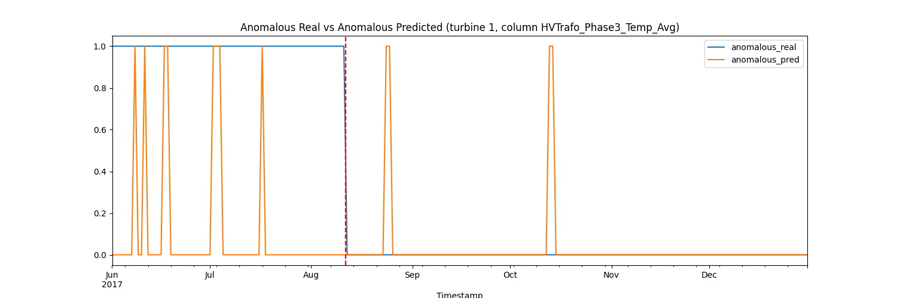

### Turbine 6

#### HYDRAULIC GROUP

Benefit = 7835.33€
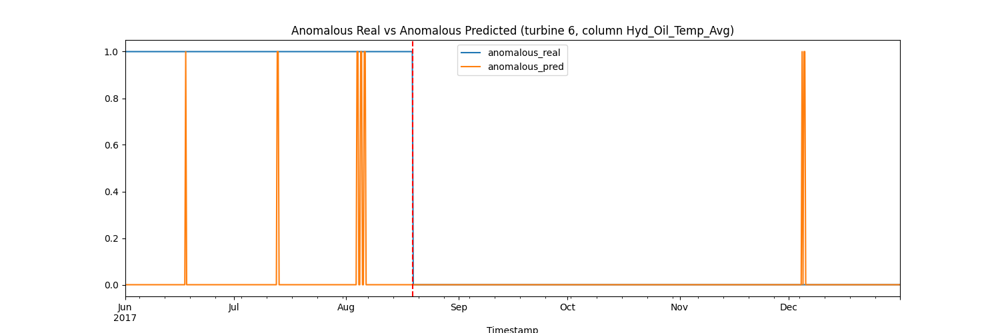

#### GEARBOX

Benefit = 59430.86€
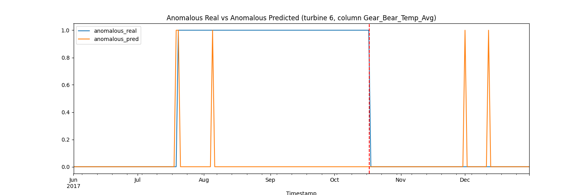

Benefit = 79875.31€
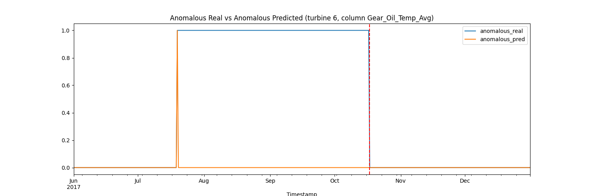

### Turbine 7

#### HYDRAULIC GROUP

Benefit = 13360.20€
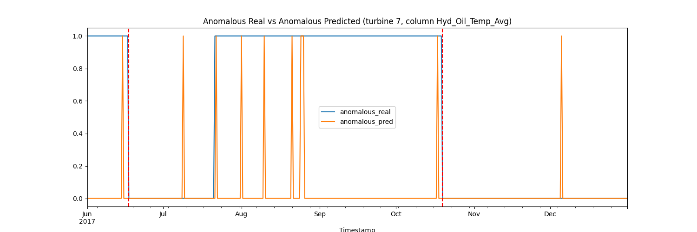

#### GENERATOR BEARING

Benefit = 14292.75€
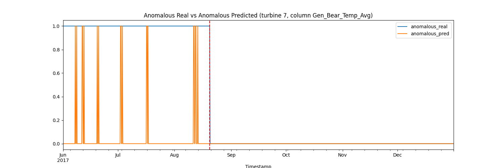

Benefit = 14244.14€
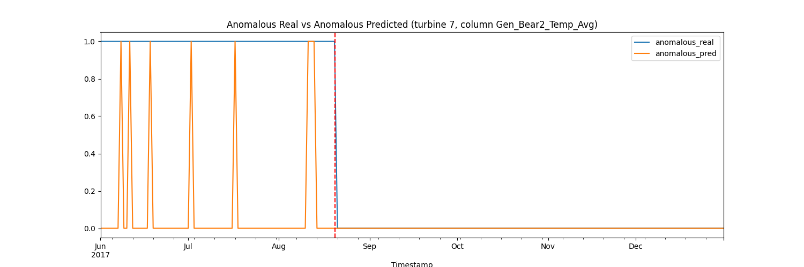

#### GENERATOR

Benefit = 27932.99€
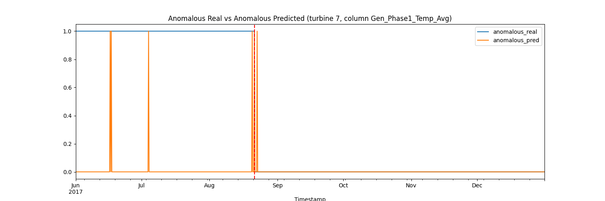

Benefit = 27932.99€
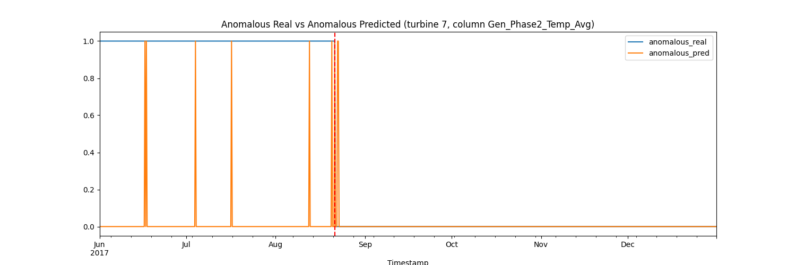

Benefit = 27932.99€
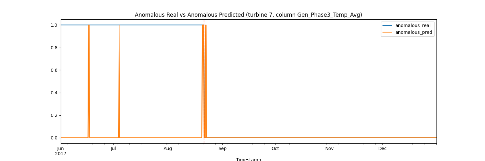

Benefit = 37432.99€
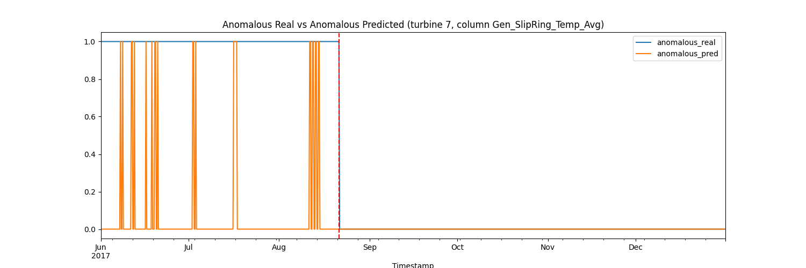

### Turbine 11

#### HYDRAULIC GROUP

Benefit = 15233.10€
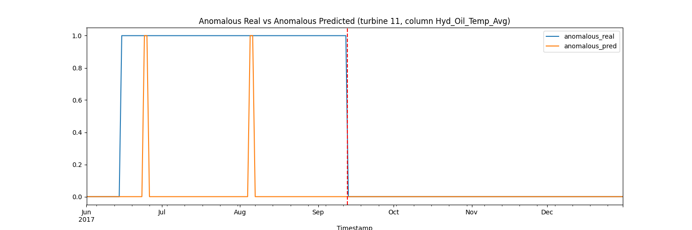

Currently the benefits of using MLflow are visible in `notebooks/3-results.ipynb` where benefits/costs are calculated for each model.

New models are able to save 200.965€ per year in maintenance costs, while the best models in the thesis were able to save 61.000€ per year. The percentage of total benefit of all the models with respect to maximum possible benefit that models can achieve is 83.74 %.

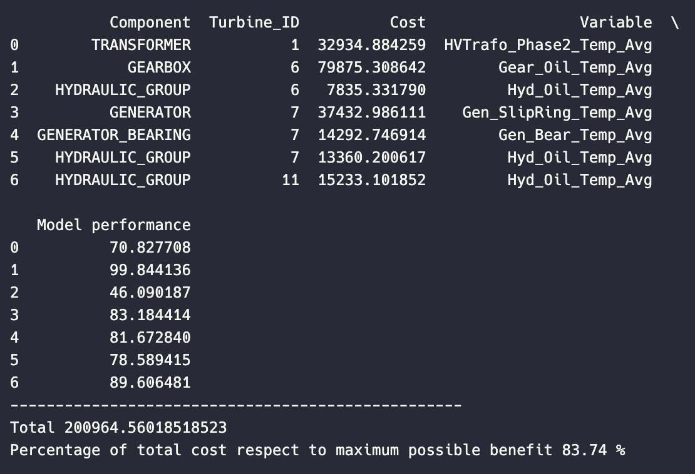